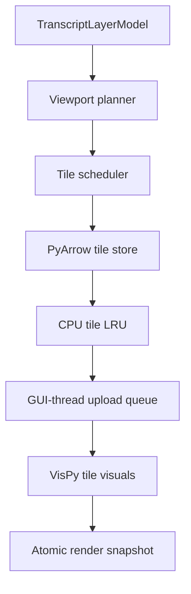

The overall architecture is strong and I would continue with it. The important caveat is that the branch is still building the foundations: it does not yet contain an end-to-end tiled cache, runtime tile loader, or napari renderer.

As of 3 August 2026, [`feature/transcripts_cache`](https://github.com/vibspatial/napari-harpy/tree/feature/transcripts_cache) is 23 commits ahead of `main`.

## What is implemented now

The branch has completed validation slices V0–V3:

| Implemented | Purpose |
|---|---|
| `PointColumnSelection`, `ParquetPointsSource` | Immutable physical-source contracts |
| SpatialData resolver | Resolves a backed points element to its canonical Parquet dataset |
| Parquet inventory | Deterministic files, row groups, schema, row counts and offsets |
| Source signature | Detects a changed/rebuilt source |
| Internal `point_id` policy | Stable identity from file offset + row position |
| Focused tests | Models, source resolution, inventory and signatures |

The [validation roadmap](https://github.com/vibspatial/napari-harpy/blob/feature/transcripts_cache/Roadmap/transcripts_visualization/validation_cache_29_7_26.md) correctly identifies V4—the bounded coordinate/value scan—as the next step. The current [`validation.py`](https://github.com/vibspatial/napari-harpy/blob/feature/transcripts_cache/src/napari_harpy/core/multi_scale_cache_points/validation.py) only performs metadata validation; it does not yet establish coordinate bounds or build the value table.

Still unimplemented:

- exact and sampled cache levels;
- `metadata.json`, `manifest.parquet`, completion/publication;
- value-aware nested sampling;
- runtime `TileStore`, planner and scheduler;
- CPU and GPU LRUs;
- `TranscriptLayerModel`;
- the VisPy tiled renderer;
- napari registration and UI integration.

So this is presently a well-specified Phase 0 implementation, not yet a working tiled viewer.

## Evaluation of the cache design

The authoritative [cache and renderer roadmap](https://github.com/vibspatial/napari-harpy/blob/feature/transcripts_cache/Roadmap/transcripts_visualization/multi_tile_cache_29_7_26.md) gets the most important architectural choices right:

- SpatialData remains canonical; the cache is deletable and derived.
- Every LOD remains points—no raster fallback.
- The exact level contains every source transcript.
- Coarser representatives are actual source transcripts with stable `point_id`.
- Levels are nested, so zooming in adds representatives instead of replacing them arbitrarily.
- Dask is restricted to offline construction.
- Runtime reads use PyArrow and known Parquet row groups.
- Cache generation, source identity and view generation are distinct.
- CPU payloads are independent of VisPy.
- GPU buffers persist across camera movements.
- Cross-level transitions are atomic.
- Palette and gene visibility changes do not require coordinate re-upload.

That is the correct shape for 100 million to billion-point datasets.

### Changes I would make before freezing the file format

1. Remove redundant tile columns from every point row.

The proposed payload stores:

```text
tile_id
tile_x
tile_y
x_rel
y_rel
value_id
point_id
```

But each row group is required to contain exactly one logical tile, and the manifest already identifies that tile. Therefore `tile_id`, `tile_x` and `tile_y` are repeated for every transcript unnecessarily.

I would store only:

```text
x_rel: float32
y_rel: float32
value_id: uint32
point_id: uint64
```

The `TileKey` and manifest supply the tile origin. This reduces storage, decoding and memory bandwidth and makes the physical contract cleaner.

2. Use generation directories plus a pointer.

The roadmap promises atomic replacement, but replacing a non-empty directory generally requires:

1. rename old cache away;
2. rename new cache into place.

There is a brief interval without a cache, and concurrent readers can observe awkward states. I would use:

```text
transcripts_vis/
  generations/
    <generation-id>/
      metadata.json
      manifest.parquet
      ...
      COMPLETED
  CURRENT
```

Build a new immutable generation and atomically replace the small `CURRENT` pointer. This also aligns naturally with `cache_generation_id` and allows an existing viewer to keep using its pinned generation.

3. Make the exact LOD rule unambiguous.

The roadmap currently says both:

- choose based on screen density and point budget;
- exact wins whenever its core tiles fit the budget.

Those can conflict. An exact view containing 150,000 points may fit the GPU budget but still place dozens of transcripts per screen pixel.

The policy should be:

```text
core_count(level) <= core_render_budget
and
projected_spacing(level) is appropriate for the marker size
```

Then select the finest eligible level. Exact should win only when it satisfies both, with an optional “force exact” diagnostic mode.

4. Prefetch must not determine the LOD.

Core tiles should have a hard point budget. Prefetch should have a separate soft byte/count budget and should be dropped before it forces a coarser visible level.

Otherwise changing the prefetch halo could visibly change the chosen LOD even though the actual viewport did not change.


6. Treat the 512-unit tile size as a benchmark default, not a universal constant.

The cache is expressed in native point coordinates. A tile edge of 512 means something different for pixels, micrometres and transformed datasets. Keep `leaf_tile_size` configurable and eventually derive a recommendation from density and coordinate units.

7. Bring selected-gene behaviour forward in the product design.

The initial tiled renderer budgets all vertices in a tile even if only five of 5,000 genes are enabled. That is safe, but it can select a coarse LOD where the enabled subset would fit exactly.

Full value-selective Parquet IO can remain later work, but the product should have an explicit strategy:

- tiled GPU-filtered mode for large/all-gene views;
- direct indexed mode for small selected-gene sets;
- eventually per-tile value counts and value-aware physical shards.

## How I would visualize the cache in napari



### 1. `TranscriptLayerModel`

A dedicated subclass of napari `Layer`, not `Points`, is the right decision.

It should own only persistent user-facing state:

- dataset/cache reference;
- complete dataset extent;
- SpatialData coordinate-system transform;
- enabled values;
- palette;
- opacity, blending and point size;
- render limits and status.

It should not expose currently resident viewport points as `layer.data`. Those points are transient rendering state, not the dataset.

### 2. A narrow napari registration adapter

This remains the riskiest integration boundary.

In napari 0.8, visual creation still uses the private `napari._vispy.utils.visual.layer_to_visual` mapping, while layer controls use a separate private `layer_to_controls` mapping. The relevant public-extension requests remain open: [custom layer/visual access #4121](https://github.com/napari/napari/issues/4121) and [multiresolution non-image layers #1019](https://github.com/napari/napari/issues/1019).

The adapter will therefore need to register approximately:

```python
layer_to_visual[TranscriptLayerModel] = VispyTranscriptLayer
layer_to_controls[TranscriptLayerModel] = QtTranscriptControls
```

I agree with isolating this in one `_napari_transcript_registration.py`. I would support a narrow napari range initially—probably napari 0.8.x—rather than pretending the existing `napari>=0.4.18` constraint covers this renderer. Napari 0.8.0 is currently the latest release. [napari 0.8.0 release](https://github.com/napari/napari/releases/tag/v0.8.0)

### 3. `VispyTranscriptLayer`

For the first backend, I recommend:

- one parent scene node representing the layer;
- one compact child visual/VBO per resident tile;
- positions stored as tile-local `(y_rel, x_rel)` float32;
- tile origin applied as the child transform;
- the normal napari layer transform applied at the parent;
- `value_id` as a compact vertex attribute;
- a palette/visibility texture addressed by `value_id`;
- opacity and point size as uniforms;
- disabled values discarded in the fragment shader;
- `point_id` kept CPU-side.

Starting with one tile visual per tile is reasonable. A typical viewport should involve tens of tiles, not thousands. Pooled VBO ranges or multi-draw should only be introduced if draw-call profiling shows they are necessary.

### 4. Scheduler and activation

Workers should only:

- resolve manifest entries;
- read PyArrow row groups;
- concatenate shards;
- return immutable NumPy/Arrow arrays.

Only the GUI/OpenGL thread should create, upload or delete VBOs.

For camera movement:

- coalesce rapid camera events;
- calculate a new generation;
- retain overlapping same-level buffers;
- prioritise missing core tiles;
- load prefetch afterward;
- reject stale results from activation;
- meter uploads per frame.

For a cross-level change, keep the previous snapshot visible until all new core tiles are GPU-ready, then switch tile visibility in one operation.

The roadmap should additionally define failure behaviour: what happens if one core tile is corrupt or cannot load? Currently an atomic transition could wait indefinitely. The scheduler needs a failed-snapshot state, timeout/error reporting and a clear decision to retain the previous LOD.

### Why a normal napari Points layer is not enough

Your observation that 100,000 points zoom smoothly is consistent with this design. Drawing 100–200k already-uploaded points is not the fundamental problem.

The problematic path would be repeatedly replacing one monolithic `Points.data` array during every pan or zoom. That triggers model events, slicing/property processing and GPU buffer replacement for the complete visible selection. It throws away the central benefit of tiled rendering: retaining overlapping GPU buffers and uploading only entering tiles.

The custom layer is justified primarily by persistent independently addressable tile buffers—not because VisPy is intrinsically unable to draw 100k points.

## Recommended development order

I would preserve most of the roadmap but insert one early integration spike:

1. Finish V4–V6 and validate the 136.6M-transcript Xenium source.
2. Build and benchmark the exact level.
3. Compare Layout A against Layout C; Layout C is the most promising production layout for network storage.
4. Freeze the reduced payload schema and publication model.
5. Implement and benchmark the value-aware nested sampler.
6. Implement store, planner and scheduler against a fake backend.
7. Before building the complete GPU backend, create a tiny napari 0.8 integration spike:
   - custom `Layer`;
   - private registration;
   - one synthetic tile;
   - transforms, extent, blending, removal and cleanup.
8. Implement the complete tile-retaining VisPy backend.
9. Add the viewer workflow, cache status/rebuild UI and direct-mode fallback.

Napari’s current [progressive-loading PR #9067](https://github.com/napari/napari/pull/9067) is still open and targets multiscale Image/Labels layers. Its double-buffering, generation and upload-metering ideas align closely with this roadmap, but it remains experimental. Harpy should follow its concepts and monitor it, but should not depend on it.

My bottom-line assessment: the architecture is substantially correct and unusually careful. I would not redesign it. I would fix the physical payload redundancy, publication semantics, LOD rules and sampling interpretation, and I would perform the napari registration spike earlier because that is the largest external integration risk.


# Second comments:

You are right. I mixed coordinate systems.

`512 × 512` describes a tile in native image/cache coordinates, whereas `257 transcripts / 100 µm²` is a physical-area density. Converting between them requires the dataset’s pixel-to-physical transform:

\[
A_{\text{tile}} =
(512\,s_x)(512\,s_y)\ \mu m^2
\]

where \(s_x,s_y\) are the physical pixel sizes in µm/pixel. Without that transform, the transcript count cannot be estimated from the density. The earlier 674k conclusion should therefore be discarded. Actual per-tile counts should come from the Xenium manifest/statistics and benchmarks.

## What I mean by the napari integration spike

The spike is a deliberately tiny vertical proof that the proposed custom transcript layer can live correctly inside napari 0.8.

It is not yet:

- the cache reader;
- the viewport planner;
- the tile scheduler;
- GPU residency management;
- asynchronous loading;
- the production transcript shader;
- the user-facing cache workflow.

It contains exactly one synthetic, already-in-memory tile. Its purpose is to validate the uncertain napari/VisPy boundary before we build substantial machinery behind that boundary.

Conceptually:

```text
TranscriptLayerModel
        │
        │ napari private visual registration
        ▼
VispyTranscriptLayer
        │
        ▼
One synthetic tile visual / buffer
        │
        ▼
napari canvas, camera, transforms and blending
```

## 1. Custom `TranscriptLayerModel`

Create the smallest viable subclass of `napari.layers.Layer`.

It should contain:

- the complete dataset extent;
- a dataset/cache reference or identifier;
- transcript styling properties;
- perhaps the current rendering mode;
- no complete \(N \times 2\) coordinate array.

For the spike, the cache reference can simply point to a synthetic payload held in memory.

The model must implement napari’s required abstract layer methods, but most can be intentionally minimal. The important question is whether napari accepts a layer whose logical data is a tiled dataset rather than one large NumPy array.

This proves:

- the layer can be added to the layer list;
- it can be selected, hidden and removed normally;
- napari obtains the correct dimensionality;
- napari sees the full dataset extent;
- layer state and events have sensible semantics;
- we do not have to pretend that all transcripts are a normal `Points.data` array.

A key requirement is:

> The layer extent represents the complete transcript dataset, not merely the currently resident tiles.

Otherwise reset-view and fit-to-data would jump around whenever tiles are loaded or evicted.

## 2. Private napari registration

Napari 0.8 still selects VisPy implementations using internal registration mappings. The custom layer class must be associated with a custom `VispyTranscriptLayer`. A minimal layer-controls registration will probably also be required.

This is the deliberately risky part: these are private napari APIs, rather than a stable public custom-layer plugin interface.

The spike should put all private imports and registrations in one small compatibility module, for example:

```text
viewer/transcripts/
    _layer.py
    _vispy_layer.py
    _napari_registration.py
```

Registration should be:

- explicit;
- idempotent;
- version-gated;
- easy to replace when napari changes;
- accompanied by an understandable error for unsupported napari versions.

This proves that napari can construct our VisPy object automatically when the model is added. The relevant internal registries are visible in napari’s [visual factory](https://github.com/napari/napari/blob/v0.8.0/src/napari/_vispy/utils/visual.py) and [layer-controls container](https://github.com/napari/napari/blob/v0.8.0/src/napari/_qt/layer_controls/qt_layer_controls_container.py).

## 3. One synthetic tile

The visual receives a fixed payload such as:

```python
SyntheticTile(
    tile_id=(0, 0, 0),
    coordinates_yx=...,
    feature_codes=...,
)
```

Use deliberately recognizable coordinates rather than only random points—for example, points on tile corners, diagonals and a small cross. That makes axis swaps, offset errors and double-applied transforms immediately visible.

The visual uploads the payload once and draws it using either:

- one VisPy markers visual, for the smallest possible spike; or
- one very simple custom point visual if the production payload layout must be tested immediately.

No tile loading is involved. The one-tile test isolates the model-to-visual-to-canvas path from cache and scheduling problems.

It answers:

> Can we render transcript-like data without putting it into a standard napari `Points` layer?

It does not answer:

> Can we efficiently stream and retain hundreds of tiles?

That belongs to the complete backend.

## 4. Transforms

This is one of the most important spike tests.

We need to decide precisely where each transform is applied:

1. Tile-local coordinate plus tile origin produces dataset-native coordinates.
2. The napari layer transform maps dataset-native coordinates to world coordinates.
3. The camera maps world coordinates to canvas coordinates.

The same transform must never be applied by both the transcript visual and napari.

The spike should test:

- translation;
- non-unit scale;
- a simple affine transform;
- axis ordering—napari data convention versus VisPy `x/y`;
- alignment with a small reference image layer;
- changing the layer transform after it has been added.

For example, put three transcripts at known image pixel locations, apply the same SpatialData-derived transformation to image and transcript layers, and verify that they remain aligned during pan and zoom.

If this fails, the full tile scheduler cannot fix it. That is why it belongs in the early spike.

## 5. Extent and dimensionality

The model should expose a synthetic full extent, perhaps:

```text
y: 0 … 20,000
x: 0 … 30,000
```

The resident tile might cover only:

```text
y: 4,000 … 4,512
x: 8,000 … 8,512
```

Then verify that:

- reset-view uses the 20,000 × 30,000 dataset extent;
- loading or removing the synthetic visual does not change that extent;
- napari slicing and displayed-axis state are passed correctly;
- a 2D transcript layer behaves correctly in a viewer containing higher-dimensional layers.

This establishes an important separation:

```text
Layer model extent = complete dataset
Visual contents     = currently resident subset
```

## 6. Blending and normal layer behaviour

The spike should verify that standard napari behaviour reaches the custom visual:

- visibility;
- opacity;
- blending mode;
- layer order;
- canvas background interaction;
- moving the layer above and below an image or labels layer.

We should not implement independent opacity or transform systems if `VispyBaseLayer` already propagates them. The production visual should participate in napari’s scene graph like every other layer.

The blending check should include both opaque and translucent transcript symbols, since large point populations can expose unexpected additive-looking behaviour even under ordinary alpha blending.

## 7. Removal and cleanup

Removing the layer must:

- detach the root visual from the scene graph;
- disconnect model event callbacks;
- clear references to tile visuals and buffers;
- cancel or invalidate pending work;
- prevent an already-finished callback from resurrecting the removed layer;
- make repeated add/remove cycles stable.

For the spike there are no workers, but we should still design cleanup around a closed/generation state:

```python
if self._closed or generation != self._generation:
    return
```

A useful test is to open and remove the layer repeatedly and confirm that scene nodes, callbacks and retained Python buffer objects do not accumulate. GPU deletion itself may be deferred by VisPy, so the test should verify that resource release is requested and no application handles remain.

## Spike acceptance criteria

I would call the spike complete only when:

- a custom transcript layer appears normally in the layer list;
- napari automatically constructs its custom visual;
- one synthetic tile is displayed;
- known transcript positions align with a transformed image layer;
- reset-view uses the complete dataset extent;
- opacity, visibility, blending and layer ordering work;
- removal leaves no visual nodes or callbacks behind;
- repeated add/remove does not increase retained resource counts;
- unsupported napari versions fail clearly;
- the spike has no dependency on the real cache, planner or scheduler.

It is a compatibility and lifecycle test, not a performance benchmark.

## Then: the complete tile-retaining VisPy backend

Once that contract is proven, replace the single synthetic visual with a backend managing multiple tile visuals.

The central property is retention:

> A tile that remains useful across consecutive viewport plans keeps its GPU buffer and is not re-uploaded.

The backend should provide operations approximately like:

```python
begin_snapshot(snapshot_id)
enqueue_tile_upload(snapshot_id, tile_id, payload)
mark_tile_ready(snapshot_id, tile_id)
activate_snapshot(snapshot_id)
release_tile(tile_id)
close()
```

It then adds:

- one compact GPU buffer or visual per resident tile;
- a mapping from tile ID to GPU resource;
- GPU-memory accounting;
- an LRU or weighted eviction policy;
- GUI-thread-only VisPy mutations;
- an upload queue with a per-frame/time budget;
- palette or category lookup;
- active and pending viewport snapshots;
- stale-result rejection;
- complete context-loss and layer-removal cleanup.

The fake backend/planner work becomes valuable here. Feed the visual backend deterministic sequences such as:

```text
Viewport 1: A B
Viewport 2: B C
Viewport 3: C D
```

Then verify:

- `B` is not uploaded twice;
- `A` is evicted only when required;
- old tiles remain visible while replacements are loading;
- incomplete new snapshots do not partially overwrite the active view;
- stale uploads from an older request are ignored.

That validates the connection between scheduler semantics and GPU retention without involving Parquet/network variability.

## Finally: viewer workflow and fallback

Only after the layer and backend contracts are stable should the product workflow be added.

That phase connects:

```text
viewport/camera
    → viewport planner
    → tile scheduler
    → tile store
    → upload queue
    → tile-retaining visual
```

It also adds the user-facing states:

- cache detected and compatible;
- cache absent;
- cache stale or incompatible;
- building/rebuilding;
- ready;
- degraded or failed;
- direct mode.

A sensible mode selection would be:

```text
Auto
├── compatible cache → tiled mode
├── small/directly manageable source → direct mode
└── no usable cache → offer cache build, retain direct fallback if feasible
```

“Direct mode” should share as much rendering code as possible. Ideally it produces the same reduced tile payload in memory, bypassing only the persistent tiled cache. That makes it useful for:

- small datasets;
- correctness comparisons;
- unsupported cache versions;
- cache build failures;
- development and debugging.

## The distinction between the three stages

| Stage | What it establishes |
|---|---|
| Napari integration spike | Napari can correctly host, transform, display and destroy the custom layer |
| Tile-retaining VisPy backend | Multiple tile buffers can be retained, replaced and evicted efficiently |
| Viewer workflow | Real cache, planner, scheduler, status UI and fallback operate as one product |

So the spike is not a prototype of the entire renderer. It is a narrow test of the most fragile external boundary. If private registration, extent semantics or transform propagation are wrong, we discover that while the implementation is still one synthetic tile—not after the scheduler, caches and GPU LRU have made the failure difficult to isolate.