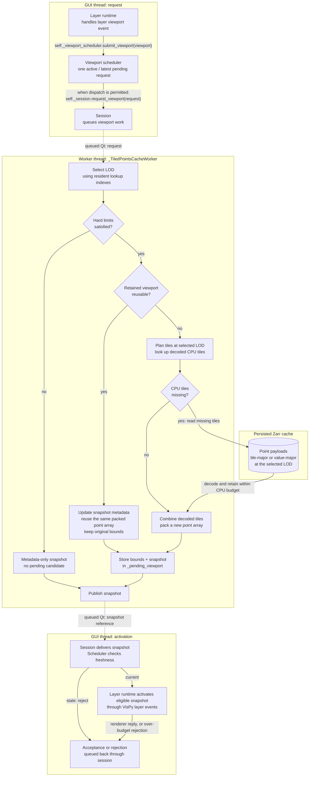

# Tiled-points viewport runtime

This document explains how a viewport change moves through the GUI, worker,
cache reader, and renderer. It describes the current implementation after cache
startup and selection-index loading, not a proposed architecture.

The overview diagram answers **what work is required**. Section 3 explains
**when a prepared candidate becomes the retained viewport**. Startup, selection
loading, cancellation, and shutdown are outside this overview.

## 1. What is passed around, and what is cached?

A **render batch** (`TiledPointsRenderBatch`) holds one immutable, contiguous
NumPy point array prepared for rendering. Each row contains a cache-relative
position (`a_position`) and a palette value ID (`a_value_id`). The positions
already include the logical tile offsets. This array lives in CPU memory;
it is not the renderer's GPU vertex buffer (VBO).

A **snapshot** (`TiledPointsRenderSnapshot`) references a render batch together
with cache/selection/request identity, LOD, counts, and status metadata. Creating
a new snapshot does not necessarily create a new point array: contained-view
reuse updates snapshot metadata while referencing the same batch object.

The runtime keeps these different kinds of state:

| State | Owner | Meaning |
| --- | --- | --- |
| `_active_request` | Scheduler, GUI thread | The one viewport request currently being processed, including its activation feedback. |
| `_pending_submission` | Scheduler, GUI thread | The latest viewport waiting to be dispatched; newer submissions replace it. No point data has been prepared for it yet. |
| `_cpu_tile_residency` | Worker | A byte-bounded LRU of decoded tile locations and value IDs. These are inputs for packing a new render batch. |
| `_pending_viewport` | Worker | Original viewport bounds paired with a candidate snapshot, awaiting GUI acceptance. |
| `_retained_viewport` | Worker | Original viewport bounds paired with the last accepted snapshot and its packed point array. This is one entry, not a history cache. |
| `_active_render_batch` and the VBO | VisPy layer, GUI-side renderer | The batch identity known to be staged successfully, and the single reusable GPU buffer. |

`_pending_submission` and `_pending_viewport` are therefore not the same queue:
the former is a future request; the latter is an already-prepared result.
The worker's pending and retained entries both use `_RetainedViewport` to keep
the bounds and snapshot paired. A pending replacement can temporarily coexist
with the retained entry; both can reference the same batch on a reuse hit.

Definitions: [render batch](../contracts.py#L307),
[snapshot](../contracts.py#L361), [retained viewport](cache_session.py#L127),
and [decoded CPU tile cache](residency.py#L13).

## 2. Overview: from viewport change to candidate snapshot

The boxes below separate GUI work, worker work, and persisted storage. The two
GUI boxes are stages on the same GUI thread, not different threads.
**Storage is not another runtime thread:** the worker calls the cache reader,
which performs the Zarr operations. LOD selection and tile planning use resident
lookup metadata rather than reading point payloads.

**Construction wiring:** the layer runtime [creates the session and scheduler](layer_runtime.py#L252)
and passes that session into the scheduler. The scheduler
[stores the same instance as `self._session`](viewport_scheduler.py#L184), rather than
creating another session. The layer runtime retains references to both objects and
supplies its `_activate_snapshot` method as the scheduler's activation callback.

The request arrows show calls through these references. The layer runtime submits
viewports through `self._viewport_scheduler`; the scheduler forwards a request through
`self._session` only when dispatch is permitted. Submission therefore does not
necessarily start worker processing immediately.

Solid arrows show local flow. Dashed arrows explicitly labelled **queued Qt**
cross the GUI/worker boundary. Repeated GUI roles denote stages involving the
same objects, not additional instances. Section 3 explains how activation
feedback updates the retained viewport.

The worker first tries the finest level meeting the preferred screen-density
target, capped by the hard limits. If none meets that preference, it can still
use the coarsest level when that level fits the hard point and vertex-byte
limits. A hard-limit failure returns metadata with an empty batch; the GUI
reports the limit without replacing the current visual.

The replacement path chooses its physical route **after LOD selection**:

- All values: tile-major `location` and point-level `value_id` payloads.
- A selected subset: value-major `location` payloads, with aligned value IDs
  reconstructed by the reader.

Both routes return the same logical tile payloads to CPU residency. The runtime
does not need a route-specific CPU tile cache. See
[route selection](../../../core/multi_scale_cache_points_zarr/reader.py#L941)
and [missing-tile reads](../../../core/multi_scale_cache_points_zarr/reader.py#L1007).

### What reuse avoids

Every viewport request still evaluates LOD and rendering limits before the
worker checks the retained entry. What happens afterwards differs:

| Outcome | Plan and look up tiles | Read point payloads | Pack a point array | Stage vertex data in the renderer |
| --- | --- | --- | --- | --- |
| Hard-limit rejection | No | No | No | No |
| Compatible retained viewport | No | No | No; reuse the same array | No, if that batch is still known-active |
| Replacement, all tiles CPU-resident | Yes | No | Yes | Yes, if accepted for activation |
| Replacement, some tiles missing | Yes | Missing tiles only | Yes | Yes, if accepted for activation |

Retained reuse requires the same cache generation, selection identity and
selected LOD, plus containment within the **original requested rectangle**.
That rectangle includes empty space; it is not the bounding box of the points.
The entire retained batch, including off-screen points, must fit both hard
limits. Reducing the visible estimate alone does not make an oversized retained
allocation eligible.

The renderer separately checks whether the batch is its known-active batch.
In the normal reuse case it skips VBO staging, but rendering still draws the
points using the current view transform. Reuse does not mean the frame is no
longer drawn. After a staging failure, an old CPU batch may need staging again.

Implementation: [worker evaluation and reuse](cache_session.py#L394),
[replacement preparation](cache_session.py#L898),
and [renderer batch-identity check](../vispy/layer.py#L164).

## 3. Acceptance: from pending candidate to retained viewport

Preparing a candidate does not replace the retained viewport. The worker
[stores it in `_pending_viewport`](cache_session.py#L596) while awaiting the
GUI's acceptance or rejection:

1. **GUI acceptance:** layer runtime's
   [`_activate_snapshot()`](layer_runtime.py#L371) returns the renderer's
   synchronous acceptance result, not completion of a GPU draw.
2. **Feedback ordering:** the scheduler
   [forwards that result before dispatching the next viewport](viewport_scheduler.py#L409).
   The session [queues it to the worker](cache_session.py#L819); the GUI does
   not wait for the worker to process it.
3. **Worker retention:** the worker's
   [`acknowledge_render_result()`](cache_session.py#L606) checks the pending
   candidate's request and selection generations. For a matching candidate,
   it clears `_pending_viewport` and promotes the candidate only when
   `applied=True`. Rejection preserves the previous `_retained_viewport`;
   unmatched replies are ignored.

Stale and over-budget snapshots do not reach the renderer and receive rejection
feedback. Rejecting a candidate does not undo decoded CPU tile-cache updates
made while preparing it.

Acceptance is not a GPU rollback guarantee. If staging has started and then
fails, the worker preserves the previous CPU batch, but the single VBO's prior
physical contents are not guaranteed to remain drawable. A later activation
can restage the retained CPU data.

## 4. Two viewport examples

Assume the cache, selection, and selected LOD remain unchanged, and the entire
retained allocation remains within the hard limits:

- **A → contained B → A:** after A is accepted, B gets a new snapshot referencing
  A's point array. Accepting B preserves A's original bounds, so returning to A
  can reuse that same array again.
- **A → disjoint C → A:** accepting C replaces A's retained entry. Returning to A
  requires packing a new array, but decoded A tiles may still be in CPU residency,
  avoiding payload reads. If C is rejected instead, A remains retained.

A contained viewport that selects a different LOD does not qualify for retained
reuse. Containment by itself is not sufficient.

## 5. Diagram names and source modules

**Layer runtime — `_TiledPointsLayerRuntime`**

GUI-side event wiring and synchronous renderer acceptance.

Module: `napari_harpy.viewer.tiled_points.runtime.layer_runtime`.
Source: [layer_runtime.py](layer_runtime.py).

**Scheduler — `_TiledPointsViewportScheduler`**

Request generations, one active/latest-pending mailbox, and activation feedback.

Module: `napari_harpy.viewer.tiled_points.runtime.viewport_scheduler`.
Source: [viewport_scheduler.py](viewport_scheduler.py).

**Session — `_TiledPointsCacheSession`; cache worker — `_TiledPointsCacheWorker`**

The session lives on the GUI thread; the worker owns reader access and reuse
state on its dedicated thread. `_RetainedViewport` is also defined here.

Module: `napari_harpy.viewer.tiled_points.runtime.cache_session`.
Source: [cache_session.py](cache_session.py).

**Decoded CPU tile cache — `_CpuTileResidency`**

Module: `napari_harpy.viewer.tiled_points.runtime.residency`.
Source: [residency.py](residency.py).

**Cache reader — `_PointsCacheReader`**

Resident lookup metadata, tile planning, and tile-major/value-major payload reads.
It is a storage-access object used by the worker, not a separate thread.

Module: `napari_harpy.core.multi_scale_cache_points_zarr.reader`.
Source: [reader.py](../../../core/multi_scale_cache_points_zarr/reader.py).
Persisted layout: [CACHE_FORMAT.md](../../../core/multi_scale_cache_points_zarr/CACHE_FORMAT.md).

**Layer model — `TiledPointsLayerModel`; VisPy layer — `VispyTiledPointsLayer`**

The model exposes the events; the renderer consumes snapshots and owns the VBO.

Modules: `napari_harpy.viewer.tiled_points.napari.layer` and
`napari_harpy.viewer.tiled_points.vispy.layer`.
Sources: [napari/layer.py](../napari/layer.py) and [vispy/layer.py](../vispy/layer.py).

**Render contracts — `TiledPointsRenderBatch`, `TiledPointsRenderSnapshot`, `TiledPointsRenderResult`**

Module: `napari_harpy.viewer.tiled_points.contracts`.
Source: [contracts.py](../contracts.py).
